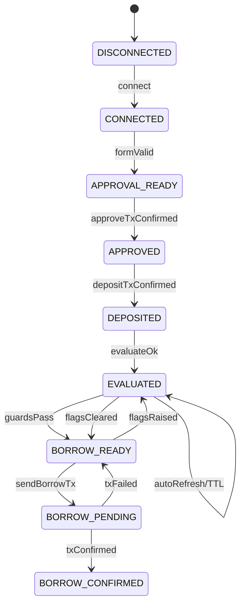

# フロントエンド UI/UX 仕様（Borrow フロー改修）

最終更新: 2025-08-12（Asia/Tokyo）  
監査フィードバック反映: 2025-08-12

---

## 目的
- 現状の「ステップごとに『次へ』を押す」ウィザードを廃止し、ワンページかつ自動進行する体験へ刷新。
- 必要条件（接続/承認/預入/評価）を自動検出し、ユーザーは主ボタン（Primary CTA）だけで進められるようにする。
- 評価アルゴリズム（`doc/algorithm.md`）の出力（CollateralValue/Confidence/L/V/W/Flags）をUIに反映し、安全ガードを徹底。

---

## 現状の課題（簡潔）
- 手動で「次へ」を押して進行させる必要があり、前提条件の未充足に気づきにくい。
- 各ステップの成否や前提（承認済みか/預入済みか）が画面遷移と分離し、迷いやすい。
- 評価値やリスクフラグが借入アクションと分断され、意思決定支援が弱い。

---

## UX 方針
- ワンページ・シングルフロー。
- 自動検出・自動進行（必要条件が満たされた時点で次アクションを提示）。
- 主ボタンは状況に応じてラベルと処理を切替（Smart CTA）。
- クリアなステータス表示（チェックリスト/チップ）と、常時見えるリスク・評価バナー。
- フェイルクローズ（危険時は押せない、理由を明示）。

---

## 情報設計
- 上部: 評価バナー（担保評価・有効LTV・HF・注意喚起）。
- 中部: 入力フォーム（NFT、Vault/LoanManager、通貨・金額など）。
- 中部右: ステータスチェックリスト（接続/承認/預入/評価/清算リスク）。
- 下部: Smart Action パネル（主ボタン、サブ操作、Tx 結果/Explorer リンク）。

---

## 主要画面/コンポーネント

### 1) Borrow（ワンページフロー）
- ルート: `/borrow`
- セクション構成:
  - 評価バナー: `EvaluationBanner`
  - 入力: `BorrowForm`
  - ステータス: `BorrowChecklist`
  - アクション: `SmartActionPanel`

### 2) EvaluationBanner（評価バナー）
- **表示レベル設計（情報過負荷対策）:**
  - **簡易表示**（デフォルト）: `maxBorrow(USD)` を大きく表示、`HF` を色付きで補助表示。
  - **詳細表示**（トグル展開）: `CollateralValue`, `effectiveLTV`, `Confidence`, `L/V/W` 詳細、評価の根拠データ。
  - 切替ボタン: 「詳細を表示」/「詳細を閉じる」（アイコン付き）。
- **警告表示**: `circuitFlags` 立ち→赤/黄アラート、`Confidence` 低/`L` 薄/`V` 高→注意表示（アイコン・色・簡潔な文言）。
- **データ取得**: `POST /api/evaluate`（将来）、MVP は `quoteSim` 情報で代替。
- **新鮮度表示**: 評価データの更新時刻（「3分前に更新」）と有効期限までの時間を表示。

### 3) BorrowForm（入力フォーム）
- フィールド:
  - `collection`（ERC-721 アドレス）
  - `tokenId`
  - `vault`（預入先）/ `loanManager`（借入先）
  - `currency`（ERC-20）＋ `decimals`（自動取得、失敗時のみ手動）
  - `amount`（人間可読）
- 機能:
  - アドレスは `CONFIG.*` の既定値を自動入力し、ユーザーが上書き可能。
  - `currency` 入力時に `decimals()` を自動読取（失敗→警告＋手動入力許可）。
  - クリップボード貼付から NFT URL をパースして `collection/tokenId` を自動抽出（任意）。
  - バリデーション: アドレス形式/数値範囲/小数桁オーバーの禁止。

### 4) BorrowChecklist（ステータスチェック）
- **項目と検出方法:**
  - ウォレット接続: `wagmi` `useAccount()`。
  - 承認済み: `ERC721.getApproved(tokenId)` が `vault` 等しい or `isApprovedForAll(owner, vault)`。
  - 預入済み: `Vault` の所有権/イベント/状態読み取り（実装依存）、暫定: 直近Txの成功で判定＋注意書き＋ `localStorage` でTxハッシュ保存して再読み込み後も復元。
  - 評価取得済み: `evaluate` 成功＆ `validUntil` 内。
  - リスク: `circuitFlags`/`Confidence`/`L`/`V` による閾値評価。
- **表示とアニメーション:**
  - 各項目: ステータスチップ（✅/⏳/⚠️/❌）＋改善アドバイス。
  - **完了時アニメーション**: 項目が完了した瞬間に緑色のフェードイン＋チェックマークの拡大アニメーション（300ms）。
  - **関連項目のハイライト**: 現在のSmartActionに対応する項目を枠線・背景色で強調表示。
- **状態の定期同期**: 30秒ごとにバックグラウンドで承認・預入状態をポーリング再確認（ユーザーが他デバイス/アプリで操作した場合に対応）。

### 5) SmartActionPanel（主ボタン＋補助）
- **主ボタン（ラベル/動作の自動切替）:**
  - 条件分岐の優先度: 接続 → 承認 → 預入 → 借入 → 完了。
  - 例: 未接続:「ウォレット接続」／未承認:「承認を送信」／未預入:「預入を送信」／借入準備OK:「借入を送信」。
  - **遷移理由の明示**: ボタン横に短い説明（例: 「（承認が完了したため）」「（評価を取得したため）」）をフェードイン表示。
- **無効化条件とメッセージ例:**
  - `evaluate` 未取得/期限切れ→「NFT評価を取得中です...」
  - `circuitFlags` 危険→「市場状況により一時的に借入を停止中です」
  - `Confidence` 低すぎ→「担保の信頼性が不足しています」
  - ガス代不足→「ガス代が不足しています。ウォレットを確認してください」
- **楽観的UI更新:**
  - Tx送信後、即座にボタンを「処理中...」に変更、UIを次の状態に仮更新。
  - 失敗時は元の状態にロールバック、成功時は仮更新を確定。
- **サブ要素:**
  - 直近 Tx の進行状況（ペンディング/確定）、Explorer へのリンク。
  - **ガス代概算表示**: 実行前に推定ガス代を USD 換算で表示（例: "推定手数料 ~$2.50"）。
  - ネットワークガード（Base Sepolia 以外→切替案内）。

---

## 状態遷移（ステートマシン）

状態:
- `DISCONNECTED`（未接続）
- `CONNECTED`（接続済み）
- `APPROVAL_READY`（NFT/先が入力済、承認前）
- `APPROVED`（承認済）
- `DEPOSITED`（預入済）
- `EVALUATED`（評価取得済、期限内）
- `BORROW_READY`（借入可能・ガード通過）
- `BORROW_PENDING`（Tx 送信中）
- `BORROW_CONFIRMED`（Tx 確定）

主要遷移トリガ:
- 接続/切断、フォーム入力の充足、チェーン読み取り結果の更新（承認/預入/評価）、Tx 終了イベント。

---

## インタラクション仕様

### 自動遷移/自動取得
- **接続/入力変更時:**
  - `approval` 状態読み取り（`getApproved`/`isApprovedForAll`）。
  - `deposit` 状態読み取り（Vault 実装に応じて）。
  - `evaluate` の取得（デバウンス 500ms、TTL 3〜5分）。
- **競合状態対策:**
  - 各 `evaluate` リクエストに一意の `requestId` を付与。
  - レスポンス処理時に「現在進行中の `requestId` と一致するか」を確認。
  - 古いリクエストの結果は破棄し、最新のリクエストのみを処理。
  - `useEffect` のクリーンアップで前のリクエストをキャンセル（`AbortController`）。
- **完了後は自動で次の主ボタンに切替**（手動「次へ」は廃止）。

### ローディング/エラー/空
- **ローディング**: スケルトン/スピナーと文言（何を待っているか）。
- **エラー（具体的メッセージ例）:**
  - 承認失敗→「承認トランザクションが失敗しました。ガス代が不足しているか、ウォレットで拒否された可能性があります。もう一度お試しください」
  - ネットワーク エラー→「ネットワークに接続できません。インターネット接続とRPCエンドポイントを確認してください」
  - 評価API エラー→「NFT評価の取得に失敗しました。しばらく待ってから再度お試しください」
  - 対処案: 再試行ボタン/設定確認案内/ネットワーク切替案内。
- **空状態**: 入力不足時のヒント（例: 「NFT のコントラクトと tokenId を入力してください」）。

### バリデーション/ガード
- `parseUnits` で小数桁溢れ/負数/空文字を阻止。
- `Confidence` < 閾値、`L` < 閾値、`circuitFlags` 危険 → 主ボタン無効＋理由明示。
- ネットワーク非対応時は全ボタン無効＋切替案内。

---

## 非機能要件
- **アクセシビリティ**: 全操作にキーボードフォーカス/Enter送信、ARIA ラベル、コントラスト比 AA、screen reader 対応。
- **レスポンシブ**: 1カラム（<640px）、2カラム（≥640px）。
- **パフォーマンス**: 重要読取（approval/owner）は並列、`evaluate` はデバウンス＋キャッシュ。
- **初回ユーザーガイダンス:**
  - 初回訪問時にオンボーディングツアー（任意スキップ可）を表示。
  - 各セクション（評価バナー、フォーム、チェックリスト、アクション）にツールチップ/インフォアイコンを配置。
  - 「初めてのユーザーですか？」リンクで基本操作ガイドを再表示可能。

---

## 設定/環境変数
- `VITE_VAULT_ADDRESS`, `VITE_LOAN_MANAGER_ADDRESS`, `VITE_AAVE_POOL_ADDRESS_BASE_SEPOLIA`。
- 評価 API エンドポイント（将来）: `VITE_EVALUATE_API_BASE`。
- ガス代 API キー（任意）: `VITE_GAS_PRICE_API_KEY`（ethgasstation 等のサードパーティサービス用）。
 
---

## ガード閾値（推奨初期値）

- 評価 TTL: 5 分（`validUntil` 超過→Borrow 無効化、3 分経過で自動再取得）
- `Confidence` 閾値: 警告 < 0.60、ブロック < 0.55
- `L`（流動性）閾値: 警告 < 0.50、ブロック < 0.40
- `V`（ボラ）閾値: 警告 > 0.60、ブロック > 0.70
- `circuitFlags` ブロック: `EMERGENCY_STOP`, `DIVERGENCE`, `THIN_LIQUIDITY`（必要に応じ追加）
- 金額上限: `amountUsd ≤ maxBorrowUsd * 0.95`（安全係数 5%）
- 取引後 HF: 送信前に `HF_post > 1.20` を推奨し、下回る場合は警告

---

## 承認方式の選択（単体承認 vs 一括承認）

- デフォルト: `approve(tokenId)`（対象トークンのみに限定）
- オプション: `setApprovalForAll(operator, true)`（大量利用時の利便性重視）
- UI:
  - トグル「このコレクションを一括承認」チェックボックス（デフォルト OFF）
  - 一括承認のリスク注意文言と「承認解除方法」へのリンク（Revoke.cash 等）

---

## ガス見積とシミュレーション

- 実装指針: `estimateGas` + `simulateContract`（可能なら）で事前検証
- セーフティマージン: 見積りに +20% 上乗せで表示（送金はウォレット側に委譲）
- USD換算: `gasPrice * gas * priceEthUsd` を表示（`VITE_GAS_PRICE_API_KEY` が無い場合はクライアントの推定値）
- エラー時: 見積り失敗の理由を表示し、再試行/設定確認を促す

---

## i18n（多言語対応）

- 既定ロケール: `ja`
- 文言管理: UI 文言はキーで集約し、`ja.json`/`en.json` などで切替
- 数値/日付: ロケールに応じたフォーマット（例: Intl.NumberFormat/DateTimeFormat）

---

## アクセシビリティ詳細

- フォーカス順序の明確化とキーボード操作（Tab/Shift+Tab/Enter）対応
- ライブリージョン: 進行状況・エラー・警告は `aria-live="polite"` で告知
- ランドマーク: `main`/`header`/`nav`/`form`/`status` の適切な役割付与

---

## データ保持/プライバシー

- `localStorage` キー例:
  - `borrow:lastTxHash`, `borrow:lastCollection`, `borrow:lastTokenId`
  - TTL 方針: 7 日で自動削除（初回保存時刻と併記）
- 「データをクリア」ボタンで即時削除可能

---

## E2E テスト観点（例）

- 基本フロー（接続→承認→預入→借入）で Smart CTA が自動遷移する
- ネットワーク誤り時にボタンが無効化され、切替案内が出る
- 評価 TTL 超過で自動再取得、超過時は Borrow 無効化
- `EMERGENCY_STOP` フラグで Borrow が停止する
- 既に承認/預入済みの場合、該当ステップをスキップして遷移する
- エラー発生時に適切なメッセージが表示され、再試行が機能する

---

## 状態遷移図（Mermaid）

---

## エラー→メッセージ対応（例）

- 承認拒否（`UserRejectedRequestError`）: 「ウォレットで拒否されました。もう一度お試しください」
- ガス不足（`InsufficientFundsError`）: 「ガス代が不足しています。ウォレット残高をご確認ください」
- 見積失敗（`EstimateGasExecutionError`）: 「ガス見積が失敗しました。入力値やネットワークを確認してください」
- ネットワーク不一致: 「対応ネットワークに切り替えてください（Base Sepolia）」
- 評価取得失敗: 「NFT評価の取得に失敗しました。しばらく待って再試行してください」

---

## テレメトリ/ログ（任意）
- 主要イベント: `approval_sent/confirmed`, `deposit_sent/confirmed`, `borrow_sent/confirmed`, `evaluate_success/fail`, `guard_blocked`。
- PII 不収集、Tx ハッシュ/チェーン ID 程度に限定。

---

## 受け入れ基準（E2E）
- **基本フロー**: 未接続で主ボタンは「ウォレット接続」。接続後、自動で承認が未了なら「承認を送信」に切替。
- **自動遷移**: 承認後は自動で「預入を送信」、成功後は「借入を送信」へ切替。手動「次へ」は存在しない。
- **安全ガード**: `evaluate` が期限切れ/危険フラグ時は主ボタン無効化、理由が表示される。
- **透明性**: すべての Tx に Explorer リンクが表示される。ガス代概算が USD で表示される。
- **レスポンシブ**: モバイル幅でも各要素が崩れず操作可能。
- **視覚的フィードバック**: チェックリスト項目の完了時にアニメーション表示。主ボタンの遷移理由が明示される。
- **エラーハンドリング**: 具体的で理解しやすいエラーメッセージが表示され、適切な対処案が提示される。

---

## 将来拡張
- 評価 API（`/api/evaluate`）統合と署名検証（EIP-712）。
- `evaluationId` を UI 状態に保持し、履歴/サポートに提示可能に。
- `Permit2` による返済 UX の改善、`Repay` ページの Smart CTA 化。
- **高度なUX機能:**
  - 操作履歴の復元（ページ離脱後の状態復旧）。
  - WebSocket を用いたリアルタイムチェーン状態同期。
  - プリセット機能（よく使う設定の保存・呼出）。
  - モバイルアプリでの WalletConnect 統合時の最適化。

---

## 付録: 実装優先度

### P0（必須・MVP）
- SmartActionPanel の自動切替と無効化ロジック
- BorrowChecklist の状態検出とポーリング
- 基本的なエラーハンドリングとローディング表示

### P1（重要・Post-MVP）  
- 楽観的UI更新とアニメーション
- ガス代概算表示
- 詳細なエラーメッセージ例の実装

### P2（改善・将来）
- 初回ユーザーガイダンス
- 評価バナーの詳細表示トグル
- 高度なUX機能（履歴復元、WebSocket等）
